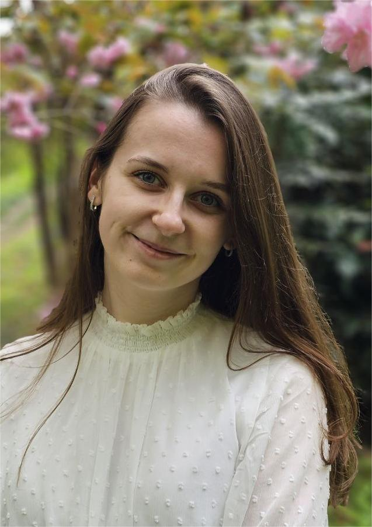

  
  

    <h2 style="font-family: Arial, sans-serif; font-size: 24px; color: #b0c4de; margin-bottom: 10px;">Aliona Vinahrad</h2>
    

I am a motivated young specialist transitioning from a career in chemistry to software development.
Currently studying to become a Java developer, I am eager to apply my analytical skills, problem-solving abilities, and passion for technology in this new field.
I am continuously learning and seeking opportunities to grow and contribute to meaningful projects.

  

### **SOFT SKILLS:**
* Сonscientious attitude to tasks
* Accuracy in work
* Multitasking
* Ability to work in a team, conflict management skills
* Ability to work with a large amount of information
* Desire to learn new methods of analysis and to develop own skills
